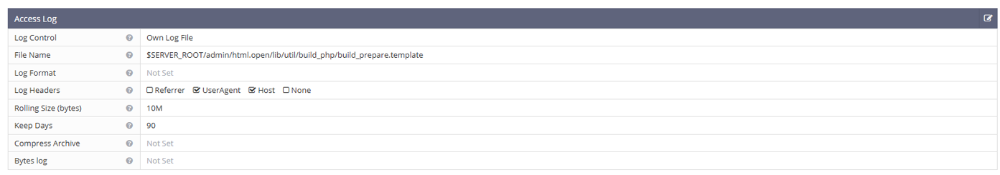
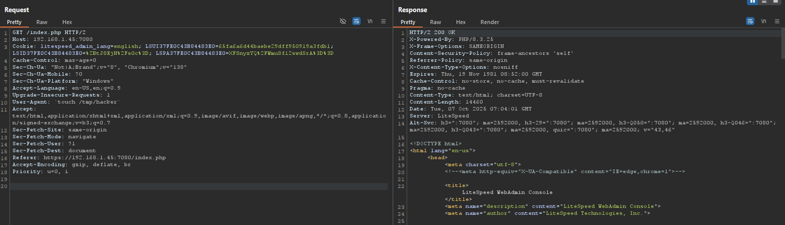
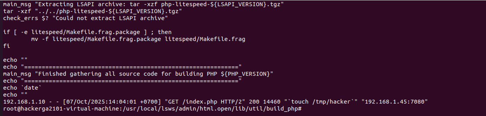
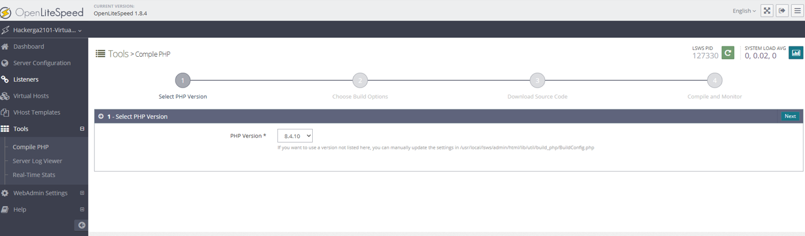
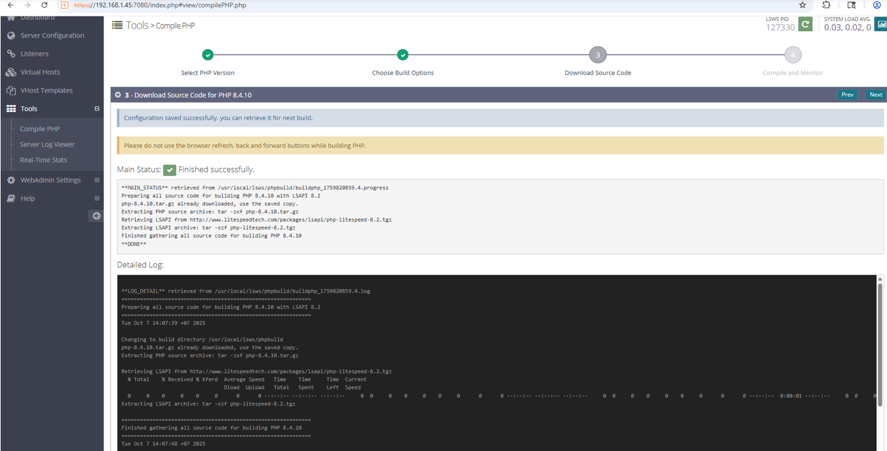
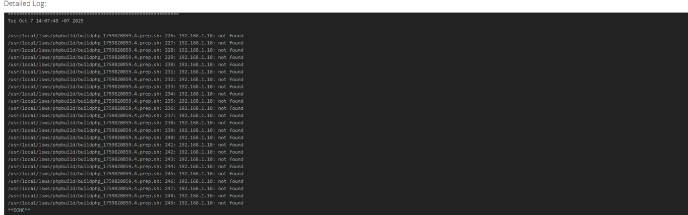
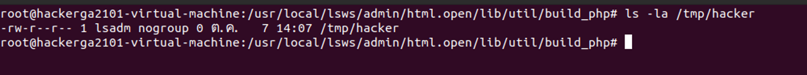

**I, General**
- Affected System: Openlitespeed
- Affected Version: v1.8.4 or earlier
- Require: Authentication
  
**II, Reproduce and Exploit**
- STEP 1: Authen with your account and access General WebAdmin Settings
  

-	You can see the Access log and Error log config section in here
-	You can change path to save Access log and Error log (Access log is where most user information is stored such as url, host, user-agent, … So that is where attackers can add input)
- STEP 2: Change config access log path to file template (/usr/local/lsws/admin/html.open/lib/util/build_php/build_prepare.template)
  

- STEP 3: Then Graceful restart to load the new config. Send a request with user-agent or url injected with bash command as follows `touch /tmp/hacker`
  

-	Check the template file again and you will see that there is a bash command injected
  

- STEP 4: Use the Compile PHP feature in the Tools section. In step 3 of this process we see, the content of the build_prepare.template file is being executed into bash and we have previously injected the bash command into this file so the touch /tmp/hacker command will be executed.
  

-	STEP 5: Check the /tmp/hacker file that has been created (You can absolutely create a more dangerous bash command like Reverse shell to verify)

